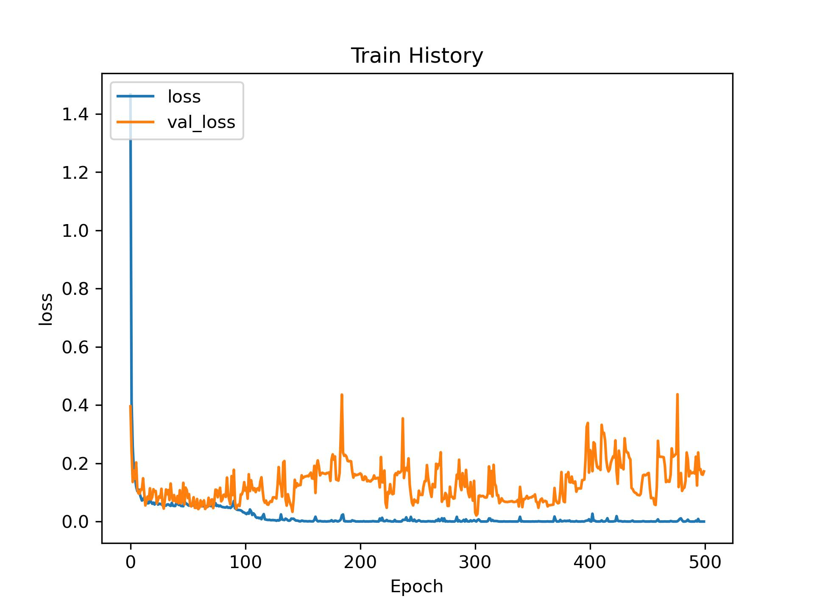

# CNN-based Handwriting Detection and Classification

[](https://github.com/1chooo/CNN-handwriting-dection)
[](https://docs.conda.io/en/latest/#)
[](https://www.tensorflow.org/)
[](https://keras.io/)
[](https://python.org "Go to Python homepage")
[](./LICENSE "Go to license section")

## A brief summary of the project
Author : ChunHo,Lin (1chooo)  

Created time: 2022/06/22  

It is the final project of the course: CE3005-B in NCU which name of the course is "Algorithmics". 

The main goal of this project is to detect the hand writing numbers with the deep learning, **CNN**.

---

## Create Enviroment

conda --version: 4.12.0
 
```
$ conda create --name algML python=3.7
$ conda install tensorflow=1.15.0
$ conda install keras=2.3.1
$ conda install matplotlib
```

You guys can also check more details about the virtual environment in the `requirements.txt` and `env.yml`

## 中文手寫辨識準確率及損失率


## Processing


## Result

