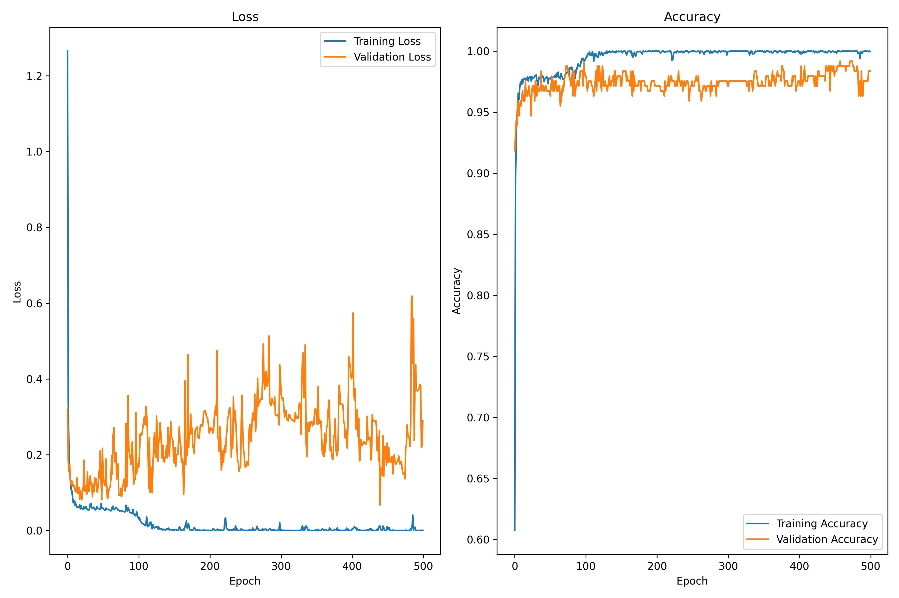

# CNN-based Handwriting Detection and Classification

[](https://github.com/1chooo/CNN-handwriting-dection)
[](./LICENSE "Go to license section")
[](https://python.org "Go to Python homepage")

[](https://docs.conda.io/en/latest/#)
[](https://www.tensorflow.org/)
[](https://keras.io/)

## A brief summary of the project
Author : Hugo ChunHo Lin (1chooo)  

Created time: 2022/06/22  

It is the final project of the course: **CE3005-B** in NCU which name of the course is "Algorithmics". 

The main goal of this project is to detect the hand writing numbers with the deep learning, **CNN**.

---

## Create Virtual Enviroment

### Build `venv` with `conda`

`conda --version: 4.12.0`
 
```
$ conda create --name algML python=3.7
$ conda install tensorflow=1.15.0
$ conda install keras=2.3.1
$ conda install matplotlib
```

You guys can also check more details about the virtual environment in the `requirements.txt` and `env.yml`

### Build `venv` with `virtualenv`

Python version `python3.10` with `tensorflow, keras, numpy, matplotlib, pandas`

#### Build `venv` for **MacOS**
```shell
$ pip3 install virtualenv
$ python3.10 -m venv venv
$ source venv/bin/activate
$ pip install -r requirements.txt
$ deactivate
$ rm -rf venv     # remove the venv
```

#### Build `venv` for Windows
```shell
$ pip install virtualenv
$ virtualenv venv
$ venv\Scripts\activate
$ pip install -r requirements.txt
$ deactivate
$ rmdir /s venv     # remove the venv
```

## 中文手寫辨識準確率及損失率

```py
print("Test loss: ", score[0])
print("Test accuracy: ", score[1])
```

| Test Loss | Test Accuracy |
| :---------: | :-------------: |
| 0.43642204999923706      | 0.9711764454841614          |

## Processing

```console
Epoch 1/500
69/69 [==============================] - 2s 16ms/step - loss: 1.3865 - accuracy: 0.5506 - val_loss: 0.3607 - val_accuracy: 0.8857
Epoch 2/500
69/69 [==============================] - 1s 14ms/step - loss: 0.3701 - accuracy: 0.8785 - val_loss: 0.1757 - val_accuracy: 0.9388
Epoch 3/500
69/69 [==============================] - 1s 13ms/step - loss: 0.2045 - accuracy: 0.9374 - val_loss: 0.1497 - val_accuracy: 0.9429
```

## Result



## Reflection on the outcome: 

這個專案是我的第一次接觸機器學習的範疇，不得不說對我而言挑戰滿大的，首先的是，要搞清楚四種投影片的內容，不得不說在聽的時候是很傾珮的，還有種原來程式，這樣寫竟然可以做到那麼多事，因為當初的我以為判斷手寫辨識需要非常多程式碼，沒想到是要透過一層層的關係來讓機器回應我們希望他做的事。接著就照自己的吸收狀況來挑選想要使用的演算法，而我挑的是 CNN。

```py
train_history = model.fit(
    data_train_X, 
    data_train_Y, 
    batch_size=32, 
    epochs=500, 
    verbose=1, 
    validation_split=0.1,
)
```

在開始製作時馬上就遇到超級大的瓶頸——讀檔，從來沒有讀過這種一層層架構的檔案，當時真的滿緊張的，畢竟剩下時間不多，對機器學習又有如個新手一般，馬上查了很多文章，還是無法，最後真的好在助教的幫助，在我凌晨還丟問題的時候細心回覆我，才得以讓我繼續向前做這份專案，我想也正是如此才得以在心得上侃侃而談吧～就此我正實做時，發現大多投影上的程式碼，都不太需要做更改，因為我發現改了太多，反而會跟原先演算法設計好的架構越走越遠，於是我在一連串的拼拼湊湊後發現了一個地方，只要花時間精准度就會提高的方法，那就更改以下這個變數宣告裡的`epochs`的次數

```console
Epoch 1/500
69/69 [==============================] - 2s 16ms/step - loss: 1.3865 - accuracy: 0.5506 - val_loss: 0.3607 - val_accuracy: 0.8857
Epoch 2/500
69/69 [==============================] - 1s 14ms/step - loss: 0.3701 - accuracy: 0.8785 - val_loss: 0.1757 - val_accuracy: 0.9388
Epoch 3/500
69/69 [==============================] - 1s 13ms/step - loss: 0.2045 - accuracy: 0.9374 - val_loss: 0.1497 - val_accuracy: 0.9429
```

精准度也從原先的96廷升到98，不過”val_loss”會大幅提升，因此我也試了把”epochs”的次數調降到比原先高但不會到500的數:200，果然，精准度只降低了一點點，”val_loss”更是大幅度地降低，

```py
print("Test loss: ", score[0])
print("Test accuracy: ", score[1])
```

| Test Loss | Test Accuracy |
| :---------: | :-------------: |
| 0.43642204999923706      | 0.9711764454841614          |

不過我想這中間肯定不是只改改這個參數這麼簡單，畢竟 CNN 是層層相依的，不過說實話以我現階段的知識，實在是太脆弱了，不過我相信以這次專案，對我而言機器學習的入門磚，我未來一定可以把這個專案玩得更出色，真的非常慶幸能有這次的體會。

## License

Released under [MIT](./LICENSE) by [@1chooo](https://github.com/1chooo).

- This software can be modified and reused without restriction.
- The original license must be included with any copies of this software.
- If a significant portion of the source code is used, please provide a link back to this repository.
